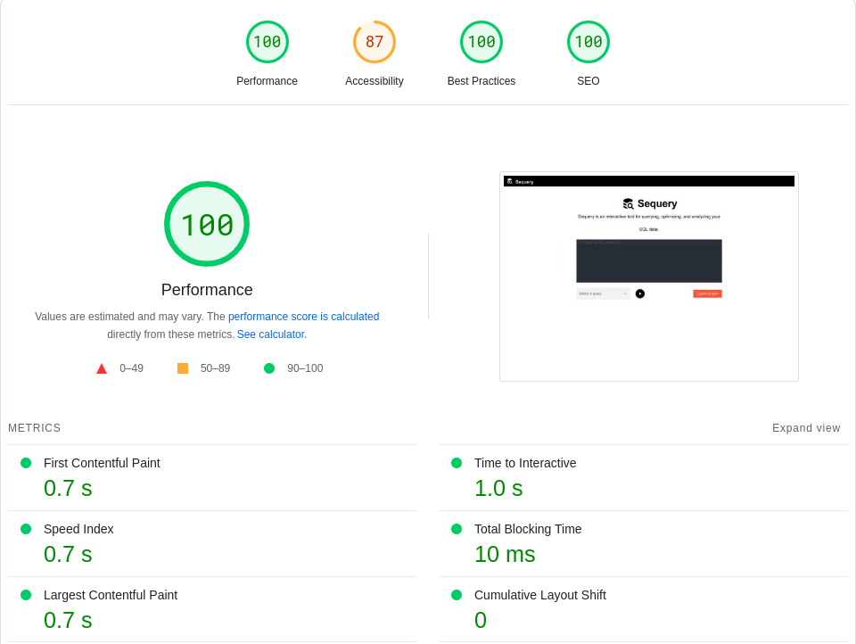

# Sequery
Sequery is an interactive tool for querying, optimizing, and analyzing your SQL data.

## Frameworks and plugins used

* Vue3
* Quasar
* Vite

## Page load time (Google PageSpeed Insights)

## optimisations

## Recommended IDE Setup

- [VS Code](https://code.visualstudio.com/) + [Volar](https://marketplace.visualstudio.com/items?itemName=Vue.volar) (and disable Vetur) + [TypeScript Vue Plugin (Volar)](https://marketplace.visualstudio.com/items?itemName=Vue.vscode-typescript-vue-plugin).
